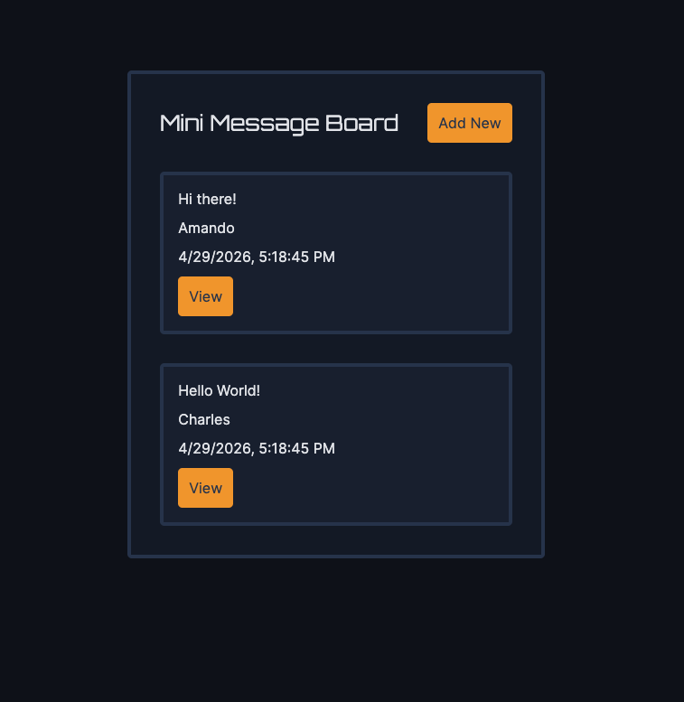
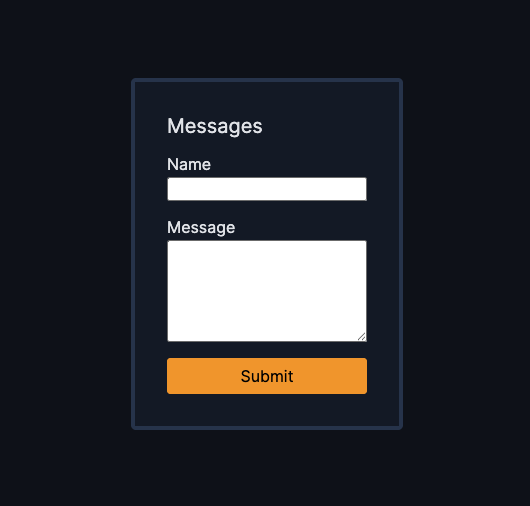
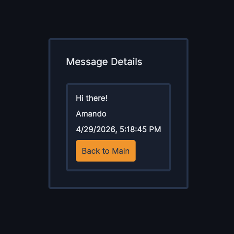

# 💬🛹 Mini Message Board

Mini message board project to help further understanding of Node.JS, Express, and EJS technologies

## 👨‍💻 Technologies

- Node.JS
- Express
- EJS
- HTML
- CSS
- JavaScript

## ✨ Features

- Message board to hold all messages
- Ability to add a new, timestamped message
- Ability to view an existing timestamped message by itself

## 👨‍🎓 What I Learned

- How to route to different pages using Express and route parameters
- How to pass values and work with partials via EJS

## 🏃‍♂️ To Run

1. Clone Repo

```
git clone https://github.com/SamsDevLab/mini-message-board.git
cd mini-message-board
```

2. Ensure node and ejs are installed:

```
npm install
npm install ejs
```

3. Run dev server

```
  npm run dev
```

4. Open server at [LocalHost:8080](http://localhost:8080/)

## 📺 Screenshots

### Message Board



### New Message



### View Message


